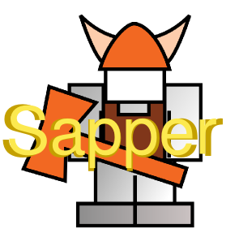
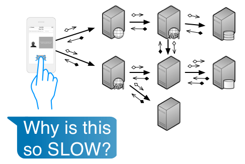

sapper
======

Span-based distributed app-tracer recommendation. This project is based on the [Dapper]([http://research.google.com/pubs/pub36356.html) paper from Google Research. I'm trying to reduce it to practice in my own job. 

Status of this Recommendation
-----------------------------
**ROUGH DRAFT**

This document hasn't been fully drafted. It isn't yet ready for rigorous review or implementation.  Of course, comments are welcome, anyway.

Introduction
------------
Modern web sites spread the work for a single user interaction across many systems. It quickly becomes difficult to understand why things fail or take as long as they do.

Sapper is a collection of documents, samples, and libraries that expand on and implement  [Dapper]([http://research.google.com/pubs/pub36356.html) concepts: logging and work-identification practices that allow you to track all the work associated with a business interaction.

### Read the Dapper Paper
I'll introduce the key concepts. But, the [Dapper]([http://research.google.com/pubs/pub36356.html) paper does a much better job and is quite readable.

### My Back Story
In 2011 I was part of a short-lived team that tried to address the scalability concerns of a major web-site. As part of my work [Tim Shadel](https://twitter.com/timshadel) introduced me to [Dapper]([http://research.google.com/pubs/pub36356.html) -- a description of how to do production performance monitoring of a distributed system. I started adapting the Dapper principles into an internal project called Sapper. 

At the time we didn't have any big data instances to funnel the logs into. Time passed. I changed teams. My initial work on Sapper sat on the internal wiki.

Fast forward to 2014. Since my initial work we have deployed Splunk throughout our organization. Many teams have indepedently come up with logging schemes for tracking the production performance of their own sub-systems. The time is ripe for a common base of logging and work-identification practices.

### Technical Environment
Because I have Splunk available at my job I plan on relying heavily on it for the big-data logging solution.

Because we use node on the front-end, a combination of single-page applications and traditional content pages, and Java on the back-end I will focus first on how to make Dapper concepts work in these technologies.

Spans
-----
In [Dapper]([http://research.google.com/pubs/pub36356.html) all work is organized into spans. A piece of work (or "span") that kicks off other work forwards on parentage information so that all the work originating from a single user interaction can be retrieved and analyzed.

Logging Format
--------------
### Common Logging Attributes
### Client Logging
### Server Logging
### Annotating a Span
#### A Timestamped Message
#### A Key-Value Pair
### Examples
HTTP Recommendations
--------------------
### Headers the Server Reads
### Headers the Client Sends
Notes on Identifiers
--------------------
Notes on Timestamps
-------------------
Notes on draining to Splunk
---------------------------
References
----------
+ _Dapper, a Large Scale Distributed Systems Tracing Infrastructure_, Benjamin H. Sigelman and Luiz André Barroso and Mike Burrows and Pat Stephenson and Manoj Plakal and Donald Beaver and Saul Jaspan and Chandan Shanbhag. 2010. [http://research.google.com/archive/papers/dapper-2010-1.pdf](http://research.google.com/archive/papers/dapper-2010-1.pdf) Google, Inc.