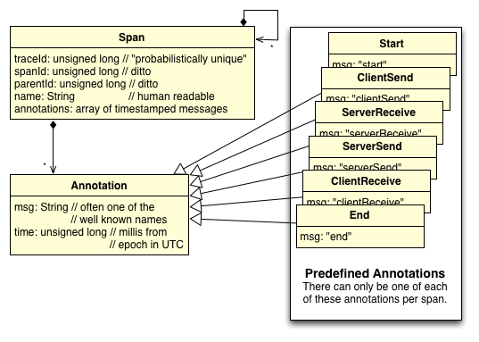

sapper
======

Span-based distributed app-tracer recommendation. This project is based on the [Dapper]([http://research.google.com/pubs/pub36356.html) paper from Google Research. I'm trying to reduce it to practice in my own job. 

Status of this Recommendation
-----------------------------
**ROUGH DRAFT**

This document hasn't been fully drafted. It isn't yet ready for rigorous review or implementation.  Of course, comments are welcome, anyway.

Introduction
------------
Modern web sites spread the work for a single user interaction across many systems. It quickly becomes difficult to understand why things fail or take as long as they do.

Sapper is a collection of documents, samples, and libraries that expand on and implement  [Dapper]([http://research.google.com/pubs/pub36356.html) concepts: logging and work-identification practices that allow you to track all the work associated with a business interaction.

### Read the Dapper Paper
I'll introduce the key concepts. But, the [Dapper]([http://research.google.com/pubs/pub36356.html) paper does a much better job and is quite readable.

### My Back Story
In 2011 I was part of a short-lived team that tried to address the scalability concerns of a major web-site. As part of my work [Tim Shadel](https://twitter.com/timshadel) introduced me to [Dapper]([http://research.google.com/pubs/pub36356.html) -- a description of how to do production performance monitoring of a distributed system. I started adapting the Dapper principles into an internal project called Sapper. 

At the time we didn't have any big data instances to funnel the logs into. Time passed. I changed teams. My initial work on Sapper sat on the internal wiki.

Fast forward to 2014. Since my initial work we have deployed Splunk throughout our organization. Many teams have indepedently come up with logging schemes for tracking the production performance of their own sub-systems. The time is ripe for a common base of logging and work-identification practices.

### Technical Environment
Because I have Splunk available at my job I plan on relying heavily on it for the big-data logging solution.

Because we use node on the front-end, a combination of single-page applications and traditional content pages, and Java on the back-end I will focus first on how to make Dapper concepts work in these technologies.

Spans
-----
In [Dapper]([http://research.google.com/pubs/pub36356.html) all work is organized into spans. A piece of work (or "span") that kicks off other work forwards on parentage information so that all the work originating from a single user interaction can be retrieved and analyzed.

Here's a rubbish class diagram. (The diagrams in the Dapper paper are better.)

### IDs Are Just Unique Integers
All id values will be "random" numbers between 0 and Long.MAX_VALUE. That is, positive 63 bit numbers, We won't generate ids from a central authority. When we need a new id we'll just make a new one that is probabilistically unique.

### TimeStamps Are Millis From the Epoch
All timestamp values are just milliseconds from the [Unix Epoch](http://en.wikipedia.org/wiki/Unix_time).

Logging Format
--------------
A span is a well identified list of time-stamped messages. *The way a span appears in the logs doesn't necessarilly match this ideal.* 

For example, a single span will often be logged in two halves: one from the client and one from the server.  These halves appear in different files but represent a single span. 

Not only will this span be recorded in halves, but the well-known events need not appear in a literal array. For brevity and convenience we may promote them to attributes of the span itself.

So, the idealized concept looks like this:

    // Idealized Span
    
    {
      "traceId": 1234,
      "spanId": 2345,
      "parentId": 3456,
      "name": "Example.UserLookup",
      "annotations": [
        {"msg": "start", "time": 1001},
        {"msg": "clientSend", "time": 1001},
        {"msg": "serverReceive", "time": 1003},
        {"msg": "cacheMiss // a custom message", "time": 1003},
        {"msg": "serverSend", "time": 1015},
        {"msg": "clientReceive", "time": 1016},
        {"msg": "end": "time": 1016}
      ]
    }

The span will actually look differently.  Logged in halves there will be some repeated information and neither will be a complete picture of the span.

    // Span Logged by Client
    // (the real log entry would be on one line.)
    {
      "traceId": 1234,
      "spanId": 2345,
      "parentId": 3456,
      "start": 1001,
      "clientSend": 1001,
      "clientReceive": 1016,
      "end": 1016
    }
    
    // The Same Span Logged by Server
    // (the real log entry would be on one line.)
    {
      "traceId": 1234,
      "spanId": 2345,
      "name": "Example.UserLookup",
      "serverReceive": 1003,
      "serverSend": 1015,
      "annotations": [
        {"msg": "cacheMiss // a custom message", "time": 1003}
      ]
    }

    
### Common Logging Attributes
No matter where you are logging a span from -- client or server -- there are some attributes you need to include.

+ **traceId** -- ID uniquely identifying this "business interaction" or "user interaction" through-out the entire system.
+ **spanId** -- ID uniquely identifying a piece of work done as part of the business interaction.

Not only do you have to log this information, but when spawning new spans you must forward on the traceId and generate a new spanId to pass along with the work.

### Client Logging
In addition to the commonly logged attributes of traceId and spanId the client always logs these span attributes:

+ **parentId** - spanId of the parent span.
+ **start** - timestamp for when this span started processing.
+ **clientSend** - timestamp for when the client sent the request. Of course, this is only logged in a span representing an RPC call.
+ **clientReceive** - timestamp for when a response was received from the server. Again, only logged during RPC calls.
+ **end** - timestamp for when the span is done processing.

### Server Logging
Like the client, the server logs traceId and spanId. Unlike the client, the server logs these attributes:

+ **name** - name of the span. Useful for aggregating different invocations of the same code.
+ **serverReceive** - timestamp for when a request reaches the server.
+ **serverSend** - timestamp for when the server sends its response.

### Annotating a Span
Either client or server can add custom annotations to a span.  They do this by adding msg-time pairs to an annotation array on the span.

+ **annotations** - an array of annotation objects. Each annotation has the following properties:
  + **annotation.msg** - free-form string.
  + **annotation.time** - timestamp of when the annotation was created.

#### A Timestamped Message
Right now, annotations are only timestamped string messages.

#### A Key-Value Pair
In the future we may tackle adding objects to the annotations array. For now it is unsupported. You can, however, log whatever you want elsewhere and use the spanId or traceId to correlate it.

### Examples

Scenario: Rendering a restricted page with basic statistics on it.

Sequence:

**Note:** In the following sequence I will represent the creation of an annotation as if calling the span with the `msg` and `time`. For example, adding the `"start"` annotation at time `55000` to span `mySpan` is `mySpan("start", 55000)`. The setting of span properties I will represent with `span.key=value`. For example, setting the parentId for span `mySpan` to `12002` is `mySpan.parentId=12002`.

+ User is already logged in and points browser to proper url.
+ Front-end server receives the request.
  + The front-end server middleware does some book keeping for the app developer.
    + It creates `pageSpan` to represent the page request.
    + It adds annotation`pageSpan("serverReceive", 55000)`.
    + In this case, there was no `traceID` passed in a header.  It generates an id of `11001` and stores it: `pageSpan.traceId=11001`.
    + Unsurprisingly, there was also no `spanId` header. It generates an id of `12001`: `pageSpan.spanId=12001`.
    + It generates a name for the span: `pageSpan.name="restrictedStatistics"`
  + The page is restricted so the server issues a request to the authorization service.
  + Advice around the http request library does some book-keeping for the application developer:
    + it creates a new span to represent the request to the authorization service: `authSpan`
    + It generates a new id `12002`: `authSpan.spanId=12002`
    + It timestamps the creation: `authSpan("start", 55001)`
    + it detects `pageSpan`'s id of `12001` and uses it as `parentId`: `authSpan.parentId=12001`.
    + It adds headers for passing on the `traceId` (`11001`) and `authSpan.spanId` (`12002`).
    + It detects the first byte being sent in the request annotates: `authSpan("clientSend",55002)`
  + The front-end server waits.
    + Before going idle the threading/event-loop advice or middleware detected the process going idle and annotated: `pageSpan("sleeping", 55002)`
+ The auth service receives the auth-check request.
  + The server's middleware/advice does some book keeping for the service developer.
    + It detects the special traceId and spanId headers in the request and grabs them:
      + `authServiceSpan.traceId=11001`
      + `authServiceSpan.spanId=12002`
      + (It doesn't have to generate new ones.)
    + It annotates span like a server: `authServiceSpan("serverReceive", 55005)`.
    + It introspects the name of the service and generates a default name for the span:
      + `authServiceSpan.name="authCheck"`
      + The app developer could set his own but doesn't care to.
  + The auth-server has to query a clustered database to fulfill the request.
  + Advice woven around calls to the database detect the call and does some bookkeeping for the developer.
    + It creates a new span to represent the DB call: `dbSpan`.
    + It annotates the span like a client: `dbSpan("start", 55005)`.
    + It generates a new id: `dbSpan.spanId=12003`.
    + It detects and uses `authServiceSpan.spanId` (`12002`) as the parentId: `dbSpan.parentId=12002`.
    + It generates a name for the span (because it knows that the third-party lib isn't Sapper-aware):
      + `dbSpan.name="authCheck:dbCall"`.
      + This is normally the server's job, but it isn't going to do it.
      + **NOTE:** We won't get `serverReceive` and `serverSend` events for this span. We might work around that by adding proxies close to the DB that do the proper logging. Or, we might try sending on `traceId` and `spanId` and  to post-processing the logging the database server *does* provide. For now, this is where our insight ends.
    + It adds a custom annotation with query details: `dbSpan("sending query <query>",  55005)`
    + It annotates the span: `dbSpan("clientSend", 55005)`
  + Now the app code of the auth-server has to yeild until it gets the db results. Before yielding, the threading advice adds an annotation: `authServiceSpan("sleeping", 55005)`
  + The Database chugs.
  + At `55015` the database returns the result.
  + The threading advice detects the resume and adds an annotation: `authServiceSpan("resuming", 55015)`
  + The advice woven around calls to the database completes doing bookkeeping for the developer.
    + It annotates the span:
      + `dbSpan("clientReceive", 55015)`
      + `dbSpan("end", 55015)`
    + It emits the log message for the completed span: `{"traceId": 11001, "spanId": 12003, "parentId": 12002, "name": "authCheck:dbCall", "start": 55005, "clientSend": 55005, "clientReceive": 55015, "end": 55015, "annotations":[{"msg":"sending query <query>", "time":55005}]}`
  + The auth-server processes the results. The user is authorized. It returns the result.
  + The server's middleware/advice finishes doing some bookkeeping for the service developer:
    + It annotates the span: `authServiceSpan("serverSend", 55015)`
    + It emits the log message for the completed span: `{"traceId": 11001, "spanId": 12002, "parentId", 12001, "name": "authCheck", "serverReceive": 55005, "serverSend": 55015, "annotations": [{"msg": "sleeping", "55005"}, {"msg": "resuming", "time":55015}]}`
+ The front-end server gets the auth results and resumes processing.
  + The threading/event-loop advice or middleware detected the process resuming and annotated: `pageSpan("resuming", 55017)`
  + Advice around the http request library finishes doing bookkeeping for the application developer.
    + It annotates the span:
      + `authSpan("clientReceive", 55017)`
      + `authSpan("end", 55017)`
    + It emits the log message for the completed span: `{"traceId": 11001, "spanId": 12002, "parentId": 12001, "start": 55001, "clientSend": 55002, "clientReceive": 55017, "end": 55017}`
  + The page has the go ahead to request the statistics from the statistics service.
  + Similar to the events above, advice on the http request library and threading orchestrate creating a `statSpan` and annotating it and `pageSpan` like so:
    + `statSpan.traceID=11001`, `statSpan.spanId=12004`, `statSpan.parentId=12001`, `statSpan("start", 55018)`, `statSpan("clientSend", 55018)`
    + `pageSpan("sleeping", 55018)`
  + The http advice also forwards on `traceId=11001` and `spanId=12004` in the headers sent to the statistics service.
+ Much like in the auth service middleware, the statistics service middleware does the following book-keeping for the service developer.
  + creates `statServiceSpan`; `statServiceSpan.traceId=11001`, `statServiceSpan.spanId=12004`, `statServiceSpan.name="general-statistics"`, `statServiceSpan("serverReceive", 55022)`
  + << the service developer's code runs here. No third party calls (this time). >>
  + annotates: `statServiceSpan("serverSend", 55024)`
  + emits the span in log: `{"traceId": 11001, "spanId": 12004, "name": "general-statistics", "serverReceive": 55022, "serverSend": 55024}`
+ The front-end server gets the statistics results and finishes processing.
  + As before, the http advice finishes doing bookkeeping for the app developer:
    + It annotates the span: `statSpan("clientReceive", 55027)`, `statSpan("end", 55027)`
    + It emits the log message for the span: `{"traceId": 11001, "spanId": 12004, "parentId": 12001, "start": 55018, "clientSend": 55018, "clientReceive": 55027, "end": 55027}`
  + As before the threading advice adds `pageSpan("resuming", 55027)`.
  + Finally the app developer code finishes rendering the page and returns the results.
  + The front-end server's middleware finishes doing bookkeeping for the app developer
    + It adds final annotation: `pageSpan("serverSend", 55028)`
    + It emits the final span in logs: `{"traceId": 11001, "spanId": 12001, "name": "restrictedStatistics", "serverReceive": 55000, "serverSend": 55028, "annotations": [{"msg": "sleeping", "time": 55002}, {"msg": "resuming", "time": 55017}, {"msg": "sleeping", "time": 55018}, {"msg": "resuming", "time": 55027}]}`

Phew! That got hairy.

Well, what's the output? You have several log messages in your performance logs:

    // In front-end server's logs
    {"traceId": 11001, "spanId": 12002, "parentId": 12001, "start": 55001, "clientSend": 55002, "clientReceive": 55017, "end": 55017}
    {"traceId": 11001, "spanId": 12004, "parentId": 12001, "start": 55018, "clientSend": 55018, "clientReceive": 55027, "end": 55027}
    {"traceId": 11001, "spanId": 12001, "name": "restrictedStatistics", "serverReceive": 55000, "serverSend": 55028, "annotations": [{"msg": "sleeping", "time": 55002}, {"msg": "resuming", "time": 55017}, {"msg": "sleeping", "time": 55018}, {"msg": "resuming", "time": 55027}]}
    
    // In auth-service's logs
    {"traceId": 11001, "spanId": 12003, "parentId": 12002, "name": "authCheck:dbCall", "start": 55005, "clientSend": 55005, "clientReceive": 55015, "end": 55015, "annotations":[{"msg":"sending query <query>", "time":55005}]}
    {"traceId": 11001, "spanId": 12002, "parentId", 12001, "name": "authCheck", "serverReceive": 55005, "serverSend": 55015, "annotations": [{"msg": "sleeping", "55005"}, {"msg": "resuming", "time":55015}]}
    
    // In statistics=service's logs
    {"traceId": 11001, "spanId": 12004, "name": "general-statistics", "serverReceive": 55022, "serverSend": 55024}

Merging together the log messages relating to the same spans you have the following information:

    Trace 11001
    
    Time  | Span 12001        | Span 12002               | Span 12003                 | Span 12004          |
          | Name: restricted- | Name:                    | Name:                      | Name:               |
          | Statistics        | authCheck                | authCheck:dbCall           | general-statistics  |
          | Parent: ROOT      | Parent: 12001            | Parent: 12002              | Parent: 12001       |
    ------+-------------------+--------------------------+----------------------------+---------------------+
    55000 | serverReceive     |                          |                            |                     |
    55001 |                  -->start                    |                            |                     |
    55002 | sleeping          | clientSend               |                            |                     |
    55003 |                   |                          |                            |                     |
    55004 |                   |                          |                            |                     |
    55005 |                   | serverReceive + sleeping-->start + clientSend + query |                     |
    55006 |                   |                          |                            |                     |
    55007 |                   |                          |                            |                     |
    55008 |                   |                          |                            |                     |
    55009 |                   |                          |                            |                     |
    55010 |                   |                          |                            |                     |
    55011 |                   |                          |                            |                     |
    55012 |                   |                          |                            |                     |
    55013 |                   |                          |                            |                     |
    55014 |                   |                          |                            |                     |
    55015 |                   | resuming + serverSend   <--clientReceive + end        |                     |
    55016 |                   |                          |                            |                     |
    55017 | resuming         <--clientReceive            |                            |                     |
    55018 | sleeping         ---------------------------------------------------------->start + clientSend  |
    55019 |                   |                          |                            |                     |
    55020 |                   |                          |                            |                     |
    55021 |                   |                          |                            |                     |
    55022 |                   |                          |                            | serverReceive       |
    55023 |                   |                          |                            |                     |
    55024 |                   |                          |                            | serverSend          |
    55025 |                   |                          |                            |                     |
    55026 |                   |                          |                            |                     |
    55027 | resuming         <----------------------------------------------------------clientReceive + end |
    55028 | serverSend        |                          |                            |                     |

Even this crude visualization can give you some idea of the insights you might gain with this kind of performance data.  For example, it's clear that the statistics service is "slow" because of network time. Without this kind of clear data it might be difficult to get priority set on that problem. You would see "slow" (`clientSend` to `clientReceive`), but from their point of view things are snappy (`serverReceive` to `serverSend`).
  
HTTP Recommendations
--------------------
### Headers the Server Reads
### Headers the Client Sends
Notes on Identifiers
--------------------
Notes on Timestamps
-------------------
Notes on draining to Splunk
---------------------------
References
----------
+ _Dapper, a Large Scale Distributed Systems Tracing Infrastructure_, Benjamin H. Sigelman and Luiz André Barroso and Mike Burrows and Pat Stephenson and Manoj Plakal and Donald Beaver and Saul Jaspan and Chandan Shanbhag. 2010. [http://research.google.com/archive/papers/dapper-2010-1.pdf](http://research.google.com/archive/papers/dapper-2010-1.pdf) Google, Inc.